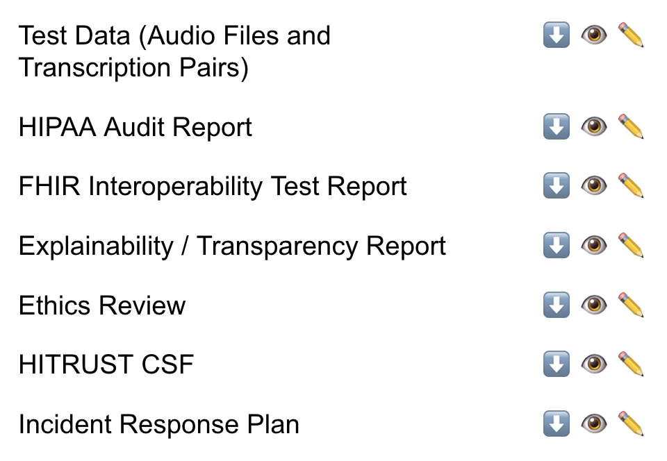
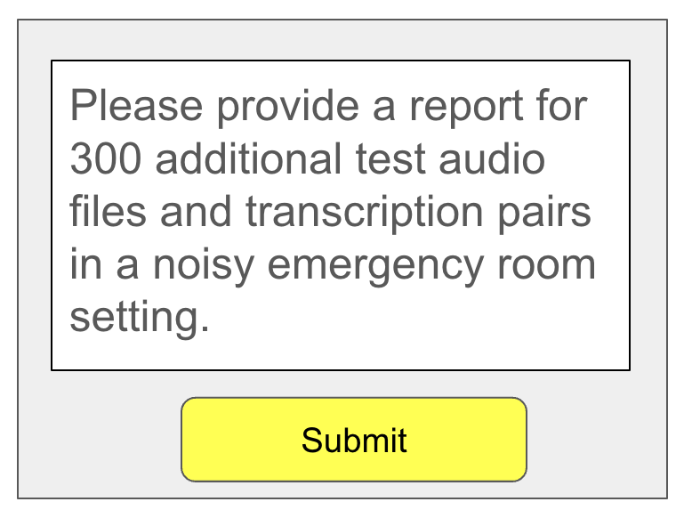
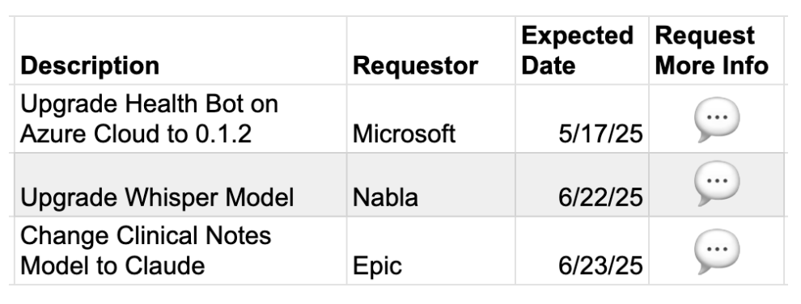
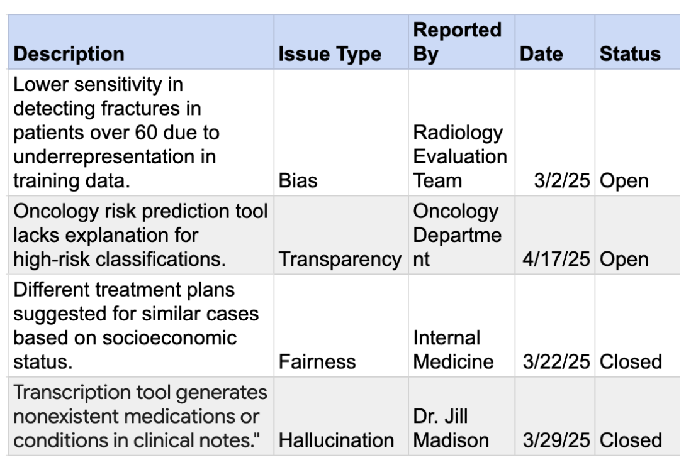

# Welcome to the SAIG Health System Repo

SAIG [System for AI Governance] is an open-source project management and collaboration tool specifically designed to meet the unique needs of AI Governance teams in Healthcare. This tool enables AI Governance committees to oversee, document, and manage AI projects effectively, ensuring compliance, transparency, and above all, patient safety throughout the lifecycle.

## Why do We Need a Specialized Open-Source Tool for AI Governance Teams?

The field of AI Governance in Healthcare is new. We're all learning as we go along. An open-source tool enables the community to share best practices when it comes to managing the safety of AI initiatives in a high-risk, life-critical domain like healthcare. The built-in risk management frameworks and model evaluation tools make it easy to vet and track hundreds of AI projects simultaneously.

## Who Is This Tool For?

The tool is created to help AI Governance committees that are managinging AI initiatives in hospitals and healthcare systems.

## What is your definition of an AI initiative?

Any initiative that involves the use of machine learning. Examples:

- Chatbots
- Disease prediction models
- EHR and RCM applications
- Clinical decision support applications
- Voice transcription applications

## What does SAIG do?

- Track and manage AI models in project, development and deployment stages.
- Maintain records of ethical reviews, security audits, HIPAA compliance, incident reports and more.
- Enable communication between multi-disciplinary teams
- Provides frameworks and templates for vetting and tracking projects
- Provides dashboards and reports to aid stakeholders in making decisions

# Screenshots

## Access Detailed Reports

In this example, team members can view test files, HIPAA audit report and more. They can download or leave notes and comments requesting for additional info.

## Ask Additional Data

In this example, a team member vetting the project is requesting the vendor to provide test reports for additional scenarios.

## Track Changes

It's common for models and hardware to be upgraded and software versions to change and these changes often affect the performance of AI applications. SAIG Health enables AI Governance Committee team members to track all AI initiatives with ease.

## Track Reported Issues

Physicians and other hospital staff can report issues with any AI model or application. These issues can be tracked by AI Governance team members for severity and remedial or preventative action can be taken.

